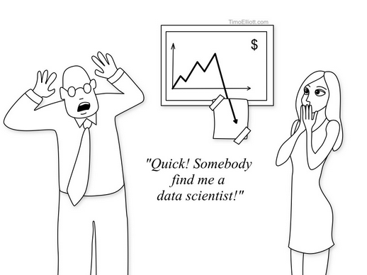
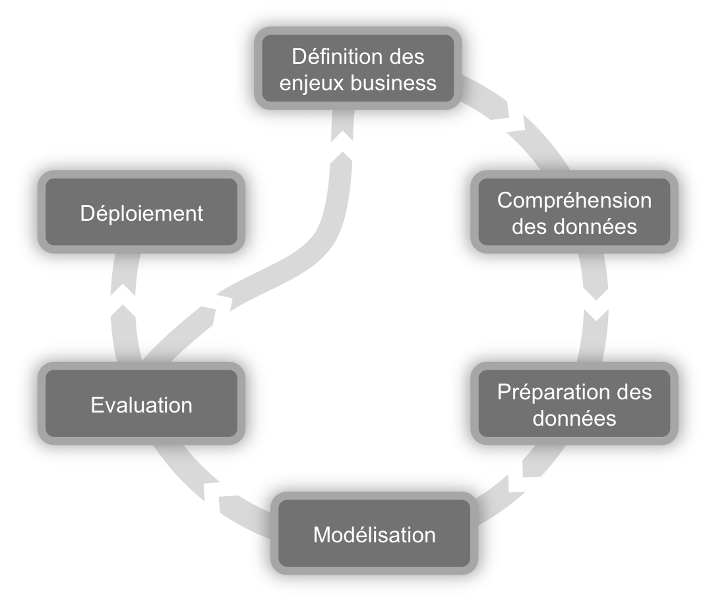
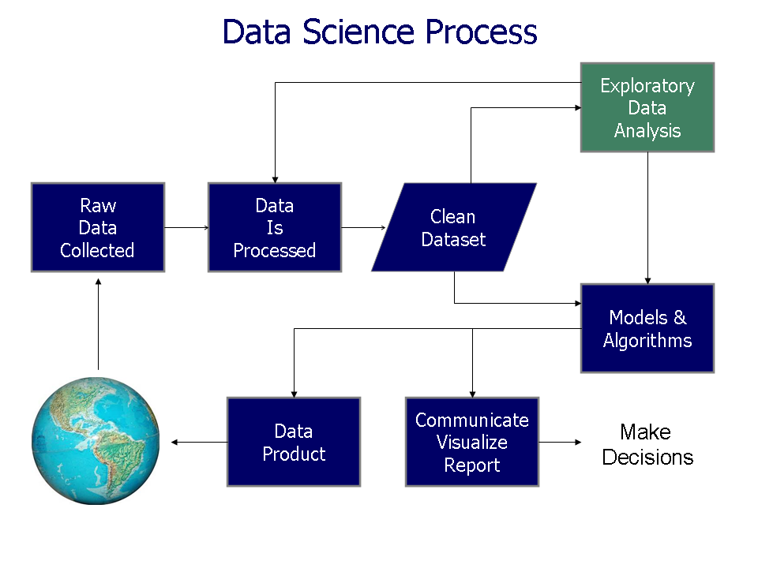

## Qui a besoin de Data Science ?

<center>

</center>


---  { tpl: slide,
       description: "Ici vient la description de la slide en quelques mots.Ici vient la description de la slide en quelques mots.Ici vient la description de la slide en quelques mots."}

## Data Science : qu'est ce que c'est exactement ?

<center>
  <a title="By Calvin.Andrus (Own work) [CC-BY-SA-3.0 (http://creativecommons.org/licenses/by-sa/3.0)], via Wikimedia Commons" href="http://commons.wikimedia.org/wiki/File%3ADataScienceDisciplines.png">
    
  </a>
</center>


--- { tpl: slide, 
      description: "<p>Ici vient la description de la slide en quelques mots.Ici vient la description de la slide en quelques mots.Ici vient la description de la slide en quelques mots.</p>"}

## Domaines d'applications

```{r domainplot, results = 'asis', comment = NA, message = F, echo = F, fig.width=12, fig.align='center' }
library(ggplot2)
df <- data.frame(
  "domain" = c("CRM/Marketing","Academic","Financial","Insurance","Technology","Telecommunication","Retail","Medical"),
  "value" = c(33,31,27,14,14,13,12,12)
  )
df$domain = factor(df$domain,  levels = df$domain[order(df$value)])
ggplot(df, aes(x=domain, y=value)) + geom_bar(stat = "identity")  + coord_flip() + theme(axis.text.x = element_text(size = 20),axis.text.y = element_text(size = 20))
```


--- { tpl: slide, 
      description: "<p>Ici vient la description de la slide en quelques mots.Ici vient la description de la slide en quelques mots.Ici vient la description de la slide en quelques mots.</p>"}

## Langages de programmation utilisés

```{r languageplot, results = 'asis', comment = NA, message = F, echo = F, fig.width=12, fig.align='center' }
library(ggplot2)
df <- data.frame(
  "language" = c("R","Python","SQL","Java","SAS"),
  "value" = c(52.5,36.1,32.1,21.2,19.7)
  )
df$language = factor(df$language,  levels = df$language[order(df$value)])
ggplot(df, aes(x=language, y=value)) + geom_bar(stat = "identity")  + coord_flip() + theme(axis.text.x = element_text(size = 20),axis.text.y = element_text(size = 20))
```


--- { tpl: mkz-cols-panels, 
      description: "<p>Voici une description qui ne se repete pas</p>"}

## Les grandes familles d'algorithmes

*** {class: span4}

### Supervisés

> - Regression
> - Decision Trees
> - Neural Nets
> - SVM
> - Bayesian Nets
> - Genetic Algorithms
> - Rules induction
> - Autres ...

*** {class: span4}

### Non Supervisés

> - ACP
> - ACM
> - Kohonen
> - Text mining
> - Bayesian Nets
> - Social Network
> - Autres ...


*** {class: span4}

### Associations

> - Association rules
> - Social Networks
> - Link Analysis
> - Collaborative filtering
> - Look alike
> - Autres ...


--- { tpl: slide, 
      description: "<p>Ici vient la description de la slide en quelques mots.Ici vient la description de la slide en quelques mots.Ici vient la description de la slide en quelques mots.</p>"}

## Utilisation des algorithmes

```{r methodeplot, results = 'asis', comment = NA, message = F, echo = F, fig.width=12, fig.align='center' }
library(ggplot2)
df <- data.frame(
  "methode" = c("Regression","Decision Trees","Cluster analyis","Neural Nets","Text mining","Associations rules","Bayesian","SVM","Anomaly detection"),
  "value" = c(69,68,58,34,30,26,23,23,14)
  )
df$methode = factor(df$methode,  levels = df$methode[order(df$value)])
ggplot(df, aes(x=methode, y=value)) + geom_bar(stat = "identity")  + coord_flip() + theme(axis.text.x = element_text(size = 20),axis.text.y = element_text(size = 20))
```


--- &mkz-section2 bg:`r pal$red` img:book_white.png

# Data fondamentaux


--- { tpl: mkz-rows-thumbs, 
      description: "<p>Voici une description qui ne se repete pas</p>"}

## Environnements techniques

*** {height: "30%", img: cloud.png}

### Cloud computing

IaaS, PaaS, SaaS, DaaS : comment tout est devenu un "Service" stocké dans les nuages.

*** {height: "30%", img: node.png}

### Systemes distribués & Map reduce

Hadoop, HDFS, Hive, MapR : comment faire basculer les traitements analytics sur une architecture scalable.

*** {height: "30%", img: db.png}

### NoSQL

Big Table, MongoDB, Hbase, CouchDB : comment les sytemes de gestion de base de données ont ils évolués.


--- { tpl: mkz-cols, 
      description: "<p>Voici une description qui ne se repete pas</p>"}

## Le Cloud Computing

*** {class: span8}

<center>

</center>

*** {class: span4}

<h4 class="content-title">Grand public :</h4>

- Gmail
- Dropbox
- iCloud
- Flickr
- et des centaines...

<h4 class="content-title">Data sciences :</h4>

- <a href="https://rstudio-dev.rm-rf.io:1480/">RStudio</a>
- yhat
- Dataiku
- autre ?


--- { tpl: mkz-rows-callout, 
      description: "<p>Avantages et inconvenients du cloud computing pour la Data science</p>"}

## Le Cloud Computing et la Data science

*** {height: "45%", type: success}

### Avantages

- Simplicité de mise en place ne necessitant qu'une très faible intervention des services technique 
- Bénéficier d'une puissance de calcul elastique grâce à la virtualisation
- Maitrise des couts grâce au "Pay per use"
- Pouvoir accéder à ses algorithmes où que l'on soit

*** {height: "45%", type: danger}

### Inconvénients

- Couteux sur le long terme (abonnement), même si la logique de calcul est assez complexe (electricité, maintenance, renouvellement de park, ...)
- Dépendance forte à un tiers
- Pour des questions juridiques, l'utilisation du cloud computing peut être tout simplement impossible


--- { tpl: slide, 
      description: "<p>Vue conceptuelle</p>"}

## Systemes distribués & Map Reduce

<center>

</center>


--- { tpl: mkz-rows-callout, 
      description: "<p>Avantages et inconvenients du distribué pour la Data science</p>"}

## Les environnements distribués et la Data science

*** {height: "45%", type: success}

### Avantages

- Possibilité de stoquer et exploiter une volumétrie de donnée gigantesque () autant de descripteur pouvant service à un modèle prédictif)
- La volumétrie des données n'est plus réellement un problème. Les algorithmes fonctionnant sur 1 000 lignes fonctionneront sur 10^9 lignes
- Emergence de nouvelles approches méthodologiques et de nouveaux algorithmes

*** {height: "45%", type: danger}

### Inconvénients

- Le stockage de la données a repris l'avantage sur l'analyse des données. Une données bien souvent inexploitable en l'état et bien trop mal struturée.
- Quid de la pertinence d'utiliser un si gros volume de données vs. des échantillonages
- Demande bien souvent une refonte complète des algorithmes traditionnels pour fonctionner en distribué


--- { tpl: mkz-cols, 
      description: "<p>Les base de données NoSQL ont été spécialement conçu pour fournir des solutions de stockage de données de hautes performances et évolutives</p>"}

## Les bases de données NoSQL

*** {class: "span5"}

### Pourquoi le NoSQL ?

- Une solution "simple" pour répondre aux problématiques de volumétrie et de non structuration de la donnée.

<br />
- Moyennant certains compromis sur les fondements mêmes des SGBD :
  -  Atomicité
  -  Consistence
  -  Durabilité

<br />
- <b>Objectifs</b> : Scalabilité et haute disponibilité

*** {class: "span1"}


*** {class: "span5"}

### Grandes familles des BDD NoSQL :

- <b>Clé / valeur</b> : Ex. <a href="http://try.redis.io/">Redis</a>

- <b>Orientées documents</b> : Ex. <a href="http://www.mongodb.org/">MongoDB</a>

- <b>Orientées graphes</b> : Ex. <a href="http://neo4j.com/">Neo4J</a>

- <b>Orientées colonnes</b> : Ex. <a href="http://cassandra.apache.org/">Cassandra</a> 

La grande majorité de ces projets sont en Open Source, voir gratuit. Profitez en !

*** {class: "span1"}


--- { tpl: mkz-rows-callout, 
      description: "<p>Avantages et inconvenients du distribué pour la Data science</p>"}

## Les BDD NoSQL et la Data science

*** {height: "45%", type: success}

### Avantages

- Scalabilité
- Données non structurée
- Données naturellemnt connecté (réseaux sociaux)

*** {height: "45%", type: danger}

### Inconvénients

- Gère mal les relations
- Pas de oncsistence
- Besoin de requetage forts (schemaless) ou complexe


--- .segue .quote .dark

<q>Un data scientist est meilleur en statistique que n'importe quel développeur et meilleur en développement que n'importe quel statisticien</q>

<style>
.dark q {
  color: white;
}
</style>

--- &mkz-section2 bg:`r pal$yellow`  img:cycle_white.png

# Data process


---

## Processus Data mining

<center>

</center>

---

## Processus Data Science

<center>

</center>


--- .segue .quote .white

<q>Passer d'une analyse <br /> à un <b>produit</b></q>

<style>
.dark q {
  color: white;
}
</style>

--- &mkz-section2 bg:`r pal$blue`   img:chart_white.png

# DATA PRODUCT


--- { tpl: slide, 
      description: "<p>Dans un contexte ou les algorithmes sont de plus en plus utilisés au quotidien il devient indispensable de suivre une logique 'produit'</p>" }

## Qu'est ce qu'un Data Product

- Au dela d'une simple analyse statistique, le Data Product à pour vocation d'ètre <b>réutilisé, partagé, mesuré, amélioré</b>
  - <b>Réutilisé</b> : Capitaliser sur un travail déjà effectué, rentabiliser le temps passé (R&D) <br /><br />
  - <b>Partagé</b> : Les outils aujourd'hui permettent le travail collaboratif très simplement <br /><br />
  - <b>Mesuré</b> : Souvent vu comme des "boites noires", les algorithmes mathématiques doivent ètre transparent et founir un maximum d'information sur leurs propre fonctionnement <br /><br />
  - <b>Amélioré</b> : En continu les algorithmes doivent être suivi, amélioré, optimisé afin de délivrer les meilleurs performances  <br /><br />


--- { tpl: slide, 
      description: "Moteur de recommandation sur site" }

## Quelques exemples de Data Product

<center>
    
</center>


--- { tpl: slide, 
      description: "Moteur de suggestion" }

## Quelques exemples de Data Product

<center>
    
</center>


--- { tpl: slide, 
      description: "Recherche d'image similaire" }

## Quelques exemples de Data Product

<center>
    
</center>


--- { tpl: slide, 
      description: "Recherche d'image similaire" }

## Quelques exemples de Data Product

<center>
    
</center>


--- { tpl: slide, 
      description: "Recherche d'image similaire" }

## Quelques exemples de Data Product

<center>
    
</center>


--- { tpl: slide, 
      description: "Recherche d'image similaire" }

## Quelques exemples de Data Product

<center>
    
</center>


--- { tpl: slide, 
      description: "Recherche d'image similaire" }

## Quelques exemples de Data Product

<center>
    
</center>


--- { tpl: slide, 
      description: "" }

## Quelques exemples de Data Product

<center>
    
</center>


--- {
 tpl: thankyou,
 social: [{title: email, href: "moehler@makazi.com"}, {title: github, href: "https://github.com/OehlR"}]
}

## Merci

<div stype="color:#FFFFFF">Pour plus d'information, contactez moi !</div>

--- 

## titre

<span class="label label-default">Default</span>
<span class="label label-primary">Primary</span>
<span class="label label-success">Success</span>
<span class="label label-info">Info</span>
<span class="label label-warning">Warning</span>
<span class="label label-danger">Danger</span>

---

## Alert

<div class="alert alert-success" role="alert"><b>Well done!</b> You successfully read this important alert message.</div>
<div class="alert alert-info" role="alert">Heads up! This alert needs your attention, but it's not super important.</div>
<div class="alert alert-warning" role="alert">Warning! Better check yourself, you're not looking too good.</div>
<div class="alert alert-danger" role="alert">Oh snap! Change a few things up and try submitting again. <a href=""  class="alert-link">With link</a></div>

---

## Panel

<div class="panel panel-primary">
  <div class="panel-heading">
    <h4 class="panel-title">Panel title</h4>
  </div>
  <div class="panel-body">
    <p>Panel content</p>
  </div>
</div>
<div class="panel panel-success">
  <div class="panel-heading">
    <h4 class="panel-title">Panel title</h4>
  </div>
  <div class="panel-body">
    <p>Panel content</p>
  </div>
</div>
<div class="panel panel-info">
  <div class="panel-heading">
    <h4 class="panel-title">Panel title</h4>
  </div>
  <div class="panel-body">
    <p>Panel content</p>
  </div>
</div>
<div class="panel panel-warning">
  <div class="panel-heading">
    <h4 class="panel-title">Panel title</h4>
  </div>
  <div class="panel-body">
    <p>Panel content</p>
  </div>
</div>
<div class="panel panel-danger">
  <div class="panel-heading">
    <h4 class="panel-title">Panel title</h4>
  </div>
  <div class="panel-body">
    <p>Panel content</p>
  </div>
</div>

--- &mkz-boot_2r_3c h1:40% h2:60%

## 2 rows and 3 columns

--- &mkz-grid

## Grid


---

