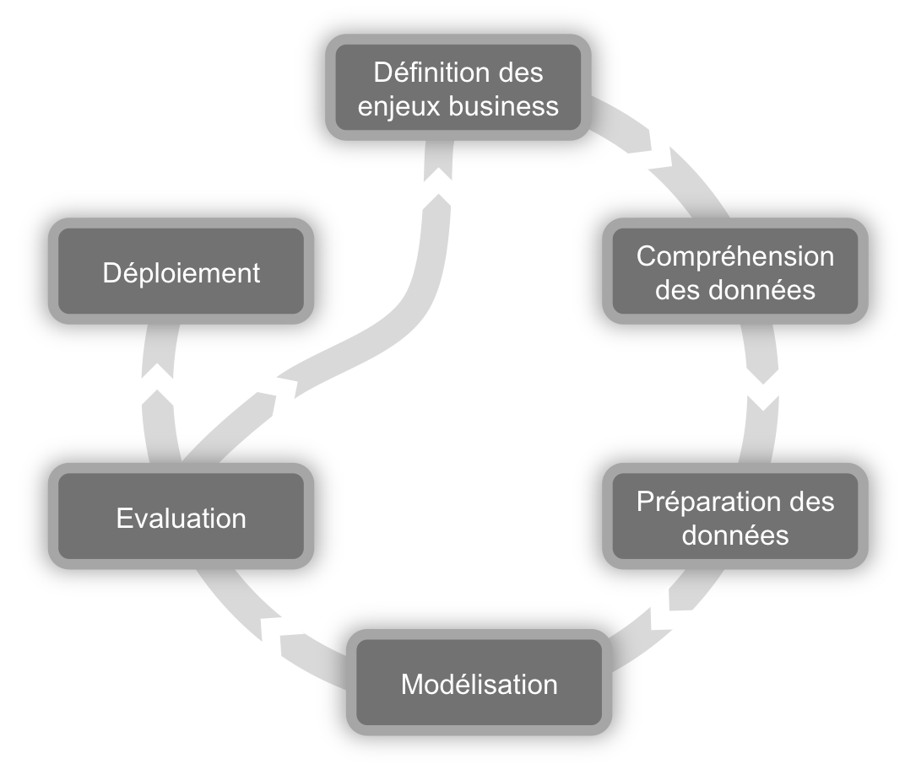
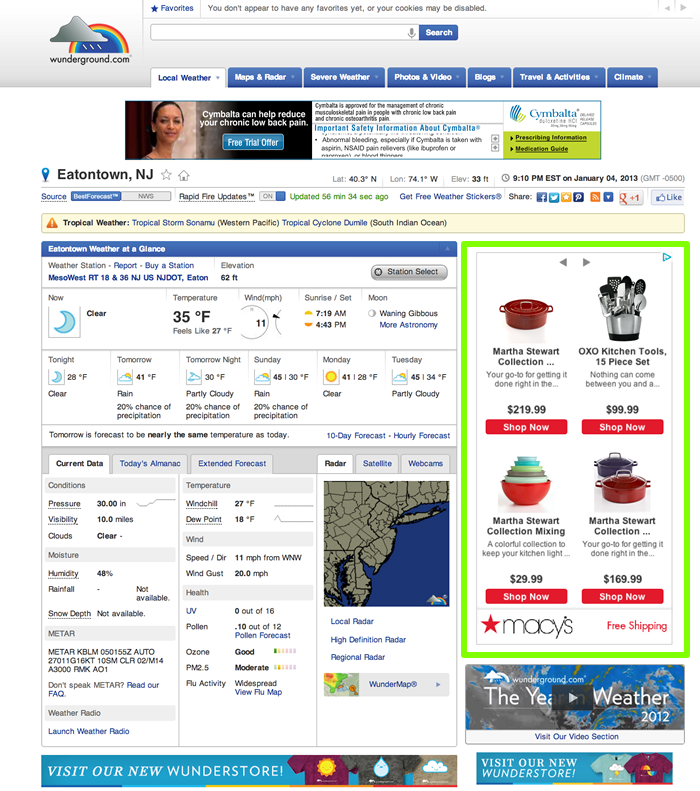
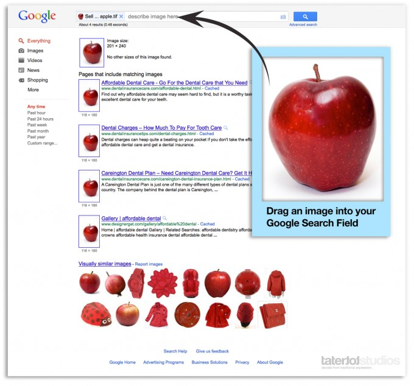
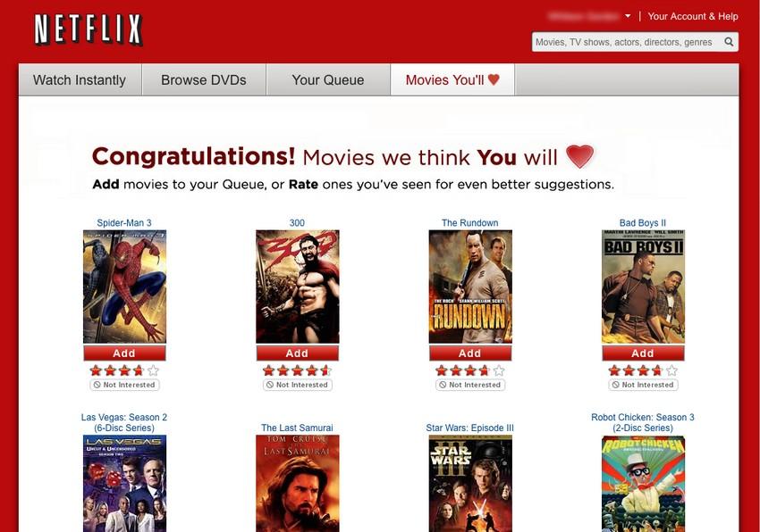

## Le processus CRISP-DM

---

## Processus émergent

--- .segue .quote .white

<q>Data Product : la fin des analyses statistiques </q>

--- &mkz-section2 bg:#7F7FCF   img:chart_white.png

# DATA PRODUCT

--- { tpl: slide, 
      description: "Moteur de recommandation sur site" }

## Quelques exemples de Data Product

    

--- { tpl: slide, 
      description: "Moteur de suggestion" }

## Quelques exemples de Data Product

    

--- { tpl: slide, 
      description: "Recherche d'image similaire" }

## Quelques exemples de Data Product

    

--- { tpl: slide, 
      description: "Recherche de musique" }

## Quelques exemples de Data Product

    

--- { tpl: slide, 
      description: "Recommandation de style vestimentaire" }

## Quelques exemples de Data Product

    

--- { tpl: slide, 
      description: "Recommandation de film" }

## Quelques exemples de Data Product

    

--- { tpl: slide, 
      description: "Prediction de la prochaine action importante" }

## Quelques exemples de Data Product

    

--- { tpl: slide, 
      description: "Suivi des performances personnelles" }

## Quelques exemples de Data Product

    

--- .segue .quote .white

<q>Par où commencer ?</q>

--- { tpl: slide, 
      description: "
Dans un contexte où les algorithmes sont de plus en plus utilisés au quotidien il devient indispensable de suivre une logique 'produit'
" }

## Les 3P

- Au dela d'une simple analyse statistique, le Data Product a pour vocation d'ètre <b>réutilisé, partagé, mesuré, amélioré</b>  

- Le Data scientist a (aussi) un casquette de développeur. Ainsi il doit savoir :
  - <b>Packager</b> : Capitaliser sur un travail déjà effectué, rentabiliser le temps passé (R&D)   
  - <b>Partager</b> : Le travail collaboratif   
  - <b>Publier</b> : Mettre en production son code   

- Créer son propre Package, le partager sur Github et le faire tester

--- { tpl: slide, 
      description: "

" }

## Proposition pour le TP

- Création d'un package

 
- Récupération de données via Webservice

 
- Analyse de données de type "Document" (twitter)

 
- Publication

--- {
 tpl: thankyou,
 social: [{title: email, href: "moehler@makazi.com"}, {title: github, href: "https://github.com/OehlR"}]
}

## Merci

Pour plus d'information, contactez moi !

---

